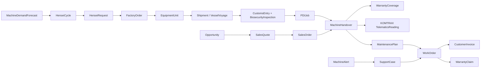

# Komatsu Australia Enterprise Ontology

An end-to-end business ontology for Komatsu Australia as an OEM equipment
distributor. It covers construction, utility and mining equipment from
**factory order to machine end-of-life**, and the parts, service,
contracts, REMAN and customer-support processes that run around each
machine.

> **Status: v0.1.0, first draft for business validation.** It is grounded in
> public information, industry standards and the standard D365 / Annata data
> models. Every Komatsu-specific assumption is listed in
> [open-questions.md](open-questions.md). Table names marked ⚠️ in the
> [data dictionary](data-dictionary.md) still need confirming against the live
> D365 / Annata 365 environment.

| | |
|---|---|
| Entity types | **71** across 13 process domains |
| Relationships | **199** (Fabric IQ-safe: unique names, no self-relationships) |
| Modules | **11** focused views + the full enterprise model |
| Standards aligned | ISO 6165, ISO 10261, ISO 14224, ISO 15143-3 (AEMP 2.0), SAE J1939, IOF (BFO), MIMOSA CCOM, schema.org, GS1 (Web Vocabulary, CBV 2.0), UN/CEFACT, OAGIS, W3C ORG / SOSA / PROV / SKOS, FIBO, Microsoft CDM, SCOR DS, APQC PCF |
| Systems bound | D365 F&O (26), Annata 365 in F&O (22), D365 CE / Dataverse (12), KOMTRAX, Power Pages portal, LIMC (KOWA lab), KACF, customs broker, factory feeds |

## Where to find it

| What | Where |
|---|---|
| Full model in the Playground | Home page (it opens by default), or `/#/catalogue/official/komatsu-au-enterprise` |
| Focused modules | Gallery → **Komatsu Australia** category, e.g. `/#/catalogue/official/komatsu-au-03-pdi` |
| Edit visually | `/#/designer/official/komatsu-au-enterprise` |
| Source of truth | [`src/data/komatsu/model.ts`](../../src/data/komatsu/model.ts) |
| Generated RDF/OWL | `catalogue/official/komatsu-au-*/*.rdf` (includes SKOS alignments, synonyms, owners and bindings) |
| Data dictionary (generated) | [data-dictionary.md](data-dictionary.md) |
| Standards rationale | [standards-alignment.md](standards-alignment.md) |
| D365 / Annata / Fabric mapping | [system-mapping.md](system-mapping.md) |
| Komatsu terms and acronyms | [glossary.md](glossary.md) |
| What we still need from the business | [open-questions.md](open-questions.md) |
| Connect to Komatsu Azure and Fabric | [azure-fabric-setup.md](azure-fabric-setup.md) |
| Evidence behind the Komatsu facts | [sources.md](sources.md) |

## Design: three layers in one model

```mermaid
flowchart LR
  subgraph L1["1 · Industry standards (why it is recognisable)"]
    S1["ISO 6165 / 10261 / 14224 / 15143-3"]
    S2["IOF + BFO, MIMOSA CCOM"]
    S3["schema.org, GS1, UN/CEFACT, OAGIS"]
    S4["SCOR DS, APQC PCF, CDM"]
  end
  subgraph L2["2 · Komatsu business model (what we mean)"]
    B1[71 entity types in business language]
    B2["Komatsu terms: Hensei, PDI, KOWA, CEP, Komplimentary Maintenance…"]
    B3[Data owner per entity]
  end
  subgraph L3["3 · Systems of record (where the data lives)"]
    D1["D365 CE / Dataverse"]
    D2["D365 F&O"]
    D3["Annata 365 AM* tables"]
    D4["KOMTRAX · LIMC · portal · factory"]
  end
  L1 -- "skos:exactMatch / closeMatch" --> L2
  L2 -- "DataBinding: table + column map" --> L3
```



1. **Industry layer.** Each entity carries `skos:*Match` links to published
   terms. Where the standard has no public IRIs (ISO, SAE, SCOR, APQC, CCOM) it
   carries a reference instead. This makes the model explainable to auditors,
   OEM partners and new staff, and it lets it interoperate with other models.
2. **Business layer.** Names are the words Komatsu people use (WorkOrder,
   PDIJob, CoreReturn, HenseiCycle). Each entity has one sentence of meaning,
   an accountable **data owner** role, and **synonyms** for the names the
   same thing has in other teams or systems (e.g. *EquipmentUnit* = Annata
   *Device* = Field Service *Customer asset*).
3. **System layer.** Each entity has one **binding** to its system-of-record
   table and a property → column map. Where the same concept also exists in
   the other platform, an **alternate table** is recorded (e.g. F&O
   `amdevicetable` ↔ Dataverse `msauto_device`).

The Playground shows layers 2 and 3: the graph, inspector and **Data Sources**
panel. All three layers are in the RDF files, so Fabric IQ, Purview, Protégé
or a triple store can use the full model.

## End-to-end value streams



| Value stream | Entity chain | Main roles |
|---|---|---|
| **Machine order-to-delivery** | MachineDemandForecast → HenseiCycle → HenseiRequest → FactoryOrder → EquipmentUnit → Shipment / VesselVoyage → CustomsEntry + BiosecurityInspection → PDIJob → MachineHandover | Hensei Planner, Logistics Coordinator, PDI Planner, Customer Project Coordinator |
| **Sales to cash** | Opportunity → SalesQuote → SalesOrder → SalesOrderLine (unit or part) → TradeIn / FinanceAgreement → CustomerInvoice | Sales Account / Key Account Manager, Sales Administration, AR |
| **Parts plan-to-stock** | PartsDemandForecast + StockingPolicy → PlanningRun → PlannedOrder → PurchaseOrder / TransferOrder → Shipment → GoodsReceipt → InventoryPosition | Inventory & Demand Planner, Parts Planner, Supply Planner |
| **Parts order-to-cash** | PortalUser / counter / VOR → SalesOrder → reservation from Warehouse → Shipment → CustomerInvoice | Parts Interpreter, Customer Support Rep |
| **Service** | MaintenancePlan / MachineAlert / SupportCase → WorkOrder → WorkOrderJob (StandardJob, FailureMode) → ResourceBooking + Technician → PartsRequirement → TimeEntry → CustomerInvoice / WarrantyClaim | Service Coordinator, Service / Maintenance Planner, Technicians |
| **Contracts & warranty** | ServiceContract (Komplimentary Maintenance, MCA, MARC) → ContractEntitlement → MaintenancePlan → WorkOrder; WarrantyCoverage → WarrantyClaim → Factory / Supplier; ServiceCampaign (PIP) → WorkOrder | Contracts Administrator, Warranty Administrator |
| **REMAN (Component Exchange)** | SalesOrder (reman exchange) → CoreReturn → Component → RemanJob → reman Part in Warehouse → WarrantyCoverage | Reman Coordinator, Reman Centre Manager |
| **Condition monitoring** | TelematicsReading, MeterReading, OilSample (KOWA), MachineAlert + FaultCode → WorkOrder | Digital Solutions (KOMTRAX), Condition Monitoring |

## Modules

| # | Module | Catalogue ID | Focus |
|---|---|---|---|
| — | Enterprise (full) | `official/komatsu-au-enterprise` | All 71 entities |
| 00 | Equipment & Product Master | `official/komatsu-au-00-equipment-master` | ISO 6165 types, models, options, units, components, parts, supersession |
| 01 | Customer & Sales to Cash | `official/komatsu-au-01-customer-sales` | CRM through invoice |
| 02 | Hensei & Machine Order-to-Delivery | `official/komatsu-au-02-hensei-order-to-delivery` | S&OP, factory orders, import, biosecurity |
| 03 | Pre-Delivery Inspection | `official/komatsu-au-03-pdi` | PDI planning, bays, fit-out, checklists |
| 04 | Parts Supply Chain & Procurement | `official/komatsu-au-04-parts-supply-chain` | P2P, warehouses, stock, transfers |
| 05 | Demand & Supply Planning | `official/komatsu-au-05-planning` | Forecasts, coverage, MRP, planned orders |
| 06 | Service & Technicians | `official/komatsu-au-06-service-technicians` | Work orders, jobs, skills, bookings, labour |
| 07 | Contracts & Warranty | `official/komatsu-au-07-contracts-warranty` | Contracts, entitlements, warranty, PIPs, rental |
| 08 | REMAN | `official/komatsu-au-08-reman` | Cores, credits, rebuilds |
| 09 | Customer Support & Portal | `official/komatsu-au-09-customer-support` | Cases, SLAs, portal users |
| 10 | Telematics & Condition Monitoring | `official/komatsu-au-10-telematics-condition` | KOMTRAX, meters, alerts, KOWA |

## Who owns what (data ownership)

| Business role | Entities |
|---|---|
| Hensei Planner (Machine Supply) | Factory, HenseiCycle, HenseiRequest, FactoryOrder |
| Machine Supply Planning / S&OP | MachineDemandForecast |
| PDI Planner | PDIJob (and ResourceBooking with Service Planner) |
| Parts Planner / Inventory & Demand Planner | PartsDemandForecast, StockingPolicy, InventoryPosition |
| Supply Planner | PlannedOrder, TransferOrder, PurchaseOrder (with Procurement) |
| Supply Planning Manager | PlanningRun |
| Procurement | Supplier, PurchaseAgreement |
| Logistics Coordinator | Shipment, VesselVoyage, CustomsEntry, BiosecurityInspection |
| Customer Project Coordinator | MachineHandover |
| Service Coordinator | WorkOrder, WorkOrderJob, TimeEntry, PartsRequirement (with Parts Interpreter) |
| Service Planner / Service Engineering | MaintenancePlan, StandardJob |
| Contracts Administrator | ServiceContract, ContractEntitlement |
| Warranty Administrator | WarrantyCoverage, WarrantyClaim, ServiceCampaign |
| Reman Coordinator / Reman Centre Manager | CoreReturn, RemanJob |
| Customer Support Manager / Digital Channels | SupportCase, PortalUser |
| Equipment Administration (Annata device master) | EquipmentUnit, MeterReading |

The full list is in the [data dictionary](data-dictionary.md).

## Modelling conventions

- **Names** follow Fabric IQ rules: 1–26 characters, letters/digits/`-`/`_`.
  Entity types are PascalCase, properties camelCase.
- **Every entity has exactly one identifier** (string), usually the business
  key the system already shows users (sales order number, serial number,
  part number).
- **The same property name has the same type everywhere.** For example,
  `status` is always an enum and `quantity` always a decimal. Fabric IQ
  requires this.
- **No self-relationships.** Fabric IQ requires source ≠ target, so
  Part → Part supersession is modelled as a `PartInterchange` entity with
  `replacesPart` and `withPart`.
- **Relationship names are unique verbs** (`servicesUnit`, `firmedAsTransfer`).
  Relationship attributes such as `fitsModel.serialFrom` are kept for the
  Playground. Fabric IQ ignores them, so the relationship's binding table
  carries them in Fabric.
- **One system of record per entity.** If a concept is mastered in F&O /
  Annata and replicated to Dataverse, the binding points at the master. The
  replica is recorded as the alternate.

## Changing the model

```bash
# 1. edit src/data/komatsu/model.ts (entities, relationships, modules)
npm run komatsu:generate   # regenerates catalogue/official/komatsu-au-* and docs/komatsu/data-dictionary.md
npx vitest run scripts/komatsu-ontology.test.ts   # validation + RDF round-trip + Fabric conversion
npm run build
```

`npm run komatsu:check` fails if the generated files are out of date. The
test suite runs it too, so the RDF can't drift from the model.

The generator enforces the Fabric IQ rules, binding integrity and module
consistency. Hand-editing the generated RDF is not supported.

## Roadmap

1. **Validate with process owners.** Walk each module in presentation mode
   with the Hensei, PDI, parts planning, service, contracts, reman and
   support leads. Work through [open-questions.md](open-questions.md).
2. **Confirm physical bindings.** Export the Annata `AM*` table/entity list
   and the Dataverse `msauto_*` tables from the Komatsu tenant. Replace every
   ⚠️ binding.
3. **Build the Fabric gold layer** (see [system-mapping.md](system-mapping.md)):
   one managed Delta table per entity type plus one link table per
   relationship. Then publish with `npm run fabric:deploy` (see
   [azure-fabric-setup.md](azure-fabric-setup.md)) and bind.
4. **Add controlled vocabularies as SKOS schemes.** Candidates are ISO 6165
   machine types, ISO 14224 failure codes, the Komatsu error-code list,
   order types, and the contract and warranty products.
5. **Add time-series bindings** for KOMTRAX (Eventhouse) on EquipmentUnit
   once Fabric IQ time-series properties are in scope.
