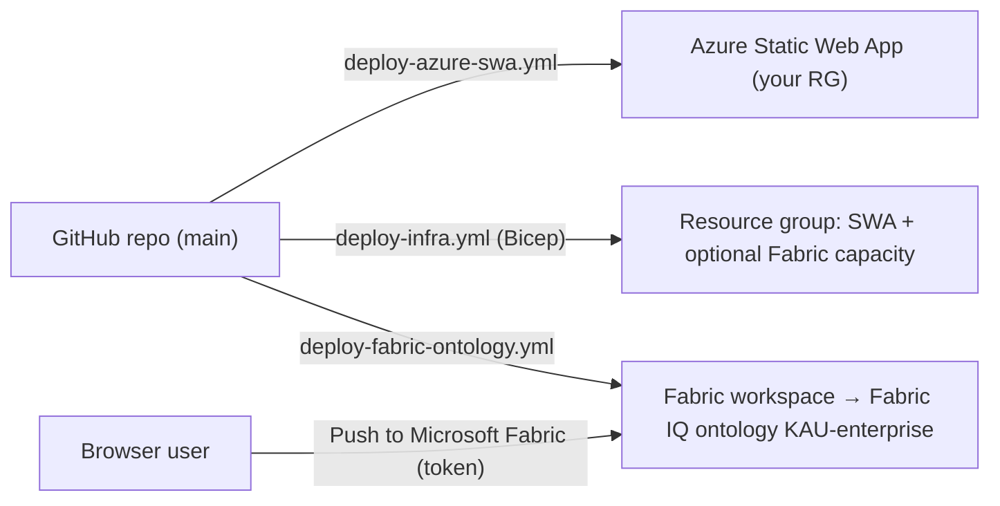

# Connecting the Workbench to Komatsu Azure and Fabric

This guide connects the repo to **your Azure resource group** (to host the
workbench) and **your Microsoft Fabric workspace** (to publish the ontology as
a Fabric IQ item). Everything is opt-in: until you set the variables below, the
deploy workflows skip themselves and only CI runs.



## What we need from you

| # | Item | Example | Used for |
|---|---|---|---|
| 1 | Azure **tenant ID** | `xxxxxxxx-…` | OIDC login, Fabric API |
| 2 | Azure **subscription ID** | `xxxxxxxx-…` | Bicep deployment |
| 3 | **Resource group** name (existing or new) | `rg-kau-dataplatform-dev` | Where the Static Web App lives |
| 4 | Naming prefix and tags (cost centre, owner) | `kau-ontology` | `infra/main.parameters.json` |
| 5 | Static Web App region | `eastasia` (SWA has no Australian region) | Hosting; content is static, data stays in Fabric |
| 6 | Existing **Fabric capacity**? If not, SKU for a new one | `F2` in `australiaeast` | Fabric IQ needs a Fabric capacity |
| 7 | Fabric **workspace ID** (GUID in the workspace URL) | `https://app.fabric.microsoft.com/groups/<guid>/…` | Where the ontology item is created |
| 8 | An **Entra app registration or user-assigned managed identity** for GitHub OIDC | `gh-kau-ontology-deployer` | Deploying infra and the ontology without stored passwords |
| 9 | Who should sign in to the workbench (Entra group) | `SG-KAU-Ontology-Users` | Restricting the site to Komatsu staff |
| 10 | GitHub organisation the repo moves to | `komatsu-au` | OIDC subject, secrets — see [github-organisation.md](github-organisation.md) |

## 1. Create the Azure resources

```bash
az login --tenant <tenant-id>
az account set --subscription <subscription-id>
az group create -n <resource-group> -l australiaeast        # if new
# review infra/main.parameters.json (prefix, tags, Fabric capacity) first
az deployment group create -g <resource-group> \
  -f infra/main.bicep -p infra/main.parameters.json
```

This creates `<prefix>-swa` (Static Web App, Standard SKU) and — only if
`deployFabricCapacity` is `true` — a Fabric capacity `<prefix>fabric`.

Alternatively run **Actions → Deploy Azure infrastructure** once OIDC is set up
(step 3).

## 2. Deploy the web app

```bash
az staticwebapp secrets list -n <prefix>-swa -g <resource-group> --query properties.apiKey -o tsv
```

In GitHub → Settings → Secrets and variables → Actions:

| Kind | Name | Value |
|---|---|---|
| Secret | `AZURE_STATIC_WEB_APPS_API_TOKEN` | the key above |
| Variable | `AZURE_SWA_ENABLED` | `true` |
| Variable | `FABRIC_WORKSPACE_ID` | workspace GUID (pre-fills *Push to Microsoft Fabric*) |

Every push to `main` now deploys; pull requests get a staging URL.

**Restrict access to Komatsu staff (recommended):** with the Standard SKU,
add Entra ID authentication in `staticwebapp.config.json` (`auth.identityProviders.azureActiveDirectory`
pointing at your tenant) and a route rule requiring the `authenticated` role, then assign
the Entra group from item 9. We'll add this once the tenant/app registration is confirmed.

## 3. Set up GitHub → Azure OIDC (no stored passwords)

1. Create an Entra app registration (or user-assigned managed identity).
2. Add a **federated credential**: issuer `https://token.actions.githubusercontent.com`,
   subject `repo:<owner>/<repo>:ref:refs/heads/main` (add one for `environment:<name>` if you use environments).
3. Grant it **Contributor** on the resource group.
4. GitHub secrets: `AZURE_CLIENT_ID`, `AZURE_TENANT_ID`, `AZURE_SUBSCRIPTION_ID`;
   variable `AZURE_RESOURCE_GROUP`.

## 4. Publish the ontology to Fabric IQ

Prerequisites in Fabric:

- The workspace is on a Fabric capacity (F-SKU or trial) with **Fabric IQ / ontology (preview)** enabled by your Fabric admin.
- Tenant setting **"Service principals can use Fabric APIs"** is enabled for a security group containing the identity from step 3.
- That identity is a **Contributor** (or Admin) on the workspace.

Then set GitHub variable `FABRIC_DEPLOY_ENABLED=true`. The **Deploy ontology to
Microsoft Fabric IQ** workflow runs on every change under `src/data/komatsu/`
(and on demand, optionally for one module). It creates or updates:

| Fabric item | Content |
|---|---|
| `KAU-enterprise` | Full model — 71 entity types, 199 relationship types |
| `KAU-03-pdi`, `KAU-05-planning`, … | A single module (run the workflow with `module`) |

From a laptop instead:

```bash
az login --tenant <tenant-id>
FABRIC_WORKSPACE_ID=<guid> npm run fabric:deploy                 # enterprise model
FABRIC_WORKSPACE_ID=<guid> npm run fabric:deploy -- --module 03-pdi
npm run fabric:deploy -- --dry-run                               # build the definition only
```

Or interactively: open the workbench → **Import / Export** → **Push to Microsoft Fabric** → paste a token from
`az account get-access-token --resource https://api.fabric.microsoft.com --query accessToken -o tsv`.

## 5. Bind the ontology to data (next phase)

Publishing creates the ontology *schema*. Binding it to D365 / Annata / KOMTRAX
data follows the medallion pattern in [system-mapping.md](system-mapping.md):

1. Enable **Link to Fabric** from the Dataverse environment (adds Dataverse and selected F&O / Annata tables to a lakehouse).
2. Build silver and gold lakehouse tables — one managed Delta table per entity type (`ont_<entity>`) and one link table per relationship.
3. Bind each entity type in Fabric to its gold table; the [data dictionary](data-dictionary.md) lists every source column.

## Security notes

- No credentials are stored in the repo. `.env.local` (ignored by git) is for local values; see `.env.example`.
- The site's Content-Security-Policy allows browser calls only to GitHub, `api.fabric.microsoft.com` and `login.microsoftonline.com`.
- Tokens pasted into *Push to Microsoft Fabric* stay in the browser tab and are not persisted.
