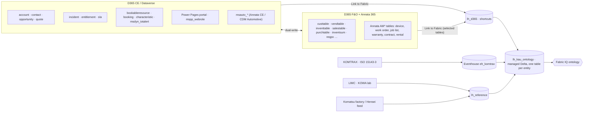

# System Mapping — D365 CE, F&O, Annata 365 and Fabric IQ

How the ontology binds to Komatsu Australia's systems of record, and how it
should be deployed to **Microsoft Fabric IQ**. The table-level binding for
every entity is in the [data dictionary](data-dictionary.md). ⚠️ marks
table/column names that still need confirming in the Komatsu tenant.

## System landscape

## System of record by domain

| Domain | Master system | Replica / consumer | Entities |
|---|---|---|---|
| Customers & contacts | F&O customer (`custtable`) + CE `contact` | CE `account` via dual-write (`accountnumber` = `accountnum`) | Customer, Contact, CustomerSite |
| Sales pipeline | CE | — | Opportunity, SalesQuote (quote ↔ `salesquotationtable`) |
| Orders & invoices | F&O | CE `salesorder` / `invoice` via dual-write | SalesOrder, SalesOrderLine, CustomerInvoice |
| Equipment master | **Annata (F&O `AMDeviceTable`)** | Dataverse `msauto_device`, Field Service `msdyn_customerasset` | EquipmentUnit, Component, MachineModel, MachineOption, MeterReading |
| Parts & inventory | F&O (+ Annata supersession) | CE product via dual-write | Part, PartInterchange, Warehouse, InventoryPosition, TransferOrder |
| Procurement | F&O | — | Supplier, PurchaseOrder, PurchaseOrderLine, PurchaseAgreement, GoodsReceipt |
| Import / landed cost | F&O landed cost (`itmtable`) + broker / DAFF records | — | Shipment, VesselVoyage, CustomsEntry ⚠️, BiosecurityInspection ⚠️ |
| Planning | F&O master planning | — | PartsDemandForecast, StockingPolicy, PlanningRun, PlannedOrder |
| Hensei / factory ordering | Komatsu factory systems + F&O intercompany PO | — | MachineDemandForecast, HenseiCycle ⚠️, HenseiRequest ⚠️, FactoryOrder |
| Workshop & field service | **Annata work orders (F&O)** | Field Service `msdyn_workorder` (if used for dispatch) | WorkOrder, WorkOrderJob, PDIJob, RemanJob, StandardJob, MaintenancePlan, PartsRequirement, TimeEntry |
| Scheduling & technicians | CE Field Service (URS) | F&O `hcmworker` | Technician, Skill, ResourceBooking, WorkshopBay |
| Contracts, warranty, rental | Annata (F&O) | CE `entitlement` for SLAs | ServiceContract, ContractEntitlement, WarrantyCoverage, WarrantyClaim, ServiceCampaign, RentalAgreement |
| Customer support & portal | CE Customer Service + Power Pages | — | SupportCase, PortalUser |
| Telematics & condition | KOMTRAX (ISO 15143-3), LIMC | CE `msdyn_iotalert` for actioned alerts | TelematicsReading, MachineAlert, FaultCode, OilSample |

## Key architecture decision: who owns the work order?

The out-of-box **Field Service ↔ F&O integration is not available after
28 February 2027**. Microsoft is moving it to Field Service + Project
Operations. Annata has its own work orders in F&O, and extends Field Service
with job lists, operation codes and warranty. Komatsu needs to decide:

| Option | Work-order master | Implication for the ontology |
|---|---|---|
| A. Annata-centric | Annata work order (F&O). Field Service only for scheduling/mobile | Bind `WorkOrder`/`PDIJob`/`RemanJob` to `amworkordertable` (current model) |
| B. Field Service-centric | `msdyn_workorder` (Dataverse) | Swap bindings to the recorded alternates. Costing via Project Operations |
| C. Hybrid | Annata for workshop, PDI and reman; Field Service for field dispatch | Keep one `WorkOrder` entity with a `serviceLocation` discriminator. The gold table unions both sources |

The ontology works with any of the three: only the binding changes. This
is listed in [open-questions.md](open-questions.md).

## Deploying to Fabric IQ

### Fabric IQ constraints this model already respects

| Constraint (Fabric IQ ontology, preview) | How the model complies |
|---|---|
| Entity and property names 1–26 chars, alphanumeric / `-` / `_` | Enforced by `validateKomatsuModel()` and the Playground validator |
| Entity key: string or integer | Every entity has one string identifier |
| Same property name ⇒ same type across entity types | Enforced |
| Relationship names unique; source ≠ target | Enforced (supersession modelled as `PartInterchange`) |
| **One static data binding per entity type** | One binding per entity. Where several entities share a physical table (e.g. `amworkordertable` for WorkOrder / PDIJob / RemanJob), the gold layer materialises one filtered table each |
| Bindings must use **managed** lakehouse tables without Delta column mapping | Bind to the gold lakehouse, not to Link-to-Fabric shortcuts |
| `Decimal` values return null in Graph | Cast amounts and quantities to `double` in the gold tables (the Playground's Fabric export already maps decimal → Double) |
| Relationships are bound through a mapping table and carry no properties | One link table per relationship. Attributes such as `fitsModel.serialFrom` live in that table |

### Recommended medallion pattern

| Layer | Contents | Notes |
|---|---|---|
| **Bronze** `lh_d365` | Link to Fabric shortcuts to Dataverse and **selected** F&O tables (F&O tables are not auto-selected) | Read-only. Deleted F&O rows carry `isDelete`. Limit of 2,000 change-tracked tables |
| **Silver** `lh_kau_silver` | Cleaned, typed, de-duplicated tables. Conformed keys `DataAreaId\|Id`. Enum codes decoded to labels | Joins such as `custtable` → `dirpartytable.name` happen here |
| **Gold** `lh_kau_ontology` | One managed Delta table per entity type (`ont_equipment_unit`, `ont_work_order` …) with columns named as the ontology properties, plus one link table per relationship (`rel_services_unit(work_order_number, serial_number)`) | This is what the Fabric IQ ontology binds to |
| **Eventhouse** `eh_komtrax` | ISO 15143-3 snapshots and fault time series | Candidate for Fabric IQ time-series properties on EquipmentUnit |

### Deployment steps

1. Enable **Link to Fabric** on the Dataverse environment and add the F&O
   and Annata tables listed in the data dictionary.
2. Build the silver and gold transformations (notebooks or Dataflow Gen2).
   The data dictionary gives each property's source column.
3. In the Playground, load `official/komatsu-au-enterprise` (or a module) →
   **Fabric Export** to create the ontology item in your workspace. You can
   also download the RDF and use your own pipeline.
4. In Fabric, bind each entity type to its gold table and each relationship
   type to its link table. Refresh the graph after data changes.

## Confirming the ⚠️ bindings

47 of 71 bindings are marked *to confirm*. Most are Annata `AM*` tables,
whose exact names are not public, and Komatsu-specific feeds. To close them:

1. **Annata F&O:** export the AOT table list or data-entity list for the
   `AM*` prefix from the Komatsu F&O environment (Annata or the
   implementation partner can supply it). Map each ⚠️ table in the dictionary.
2. **Dataverse:** in make.powerapps.com → Tables, filter on `msauto_` and
   `device` to confirm which Annata/CDM Automotive tables are installed.
3. **Field Service:** confirm whether Field Service is licensed and which
   tables (`msdyn_workorder`, `msdyn_customerasset`, `msdyn_functionallocation`)
   hold production data.
4. **External feeds:** confirm the Hensei feed, KOMTRAX API access (ISO
   15143-3 endpoint and identifiers), LIMC export, customs broker data and
   the KACF finance system.

Then update `binding` in [`src/data/komatsu/model.ts`](../../src/data/komatsu/model.ts),
remove `toConfirm`, and run `npm run komatsu:generate`.
